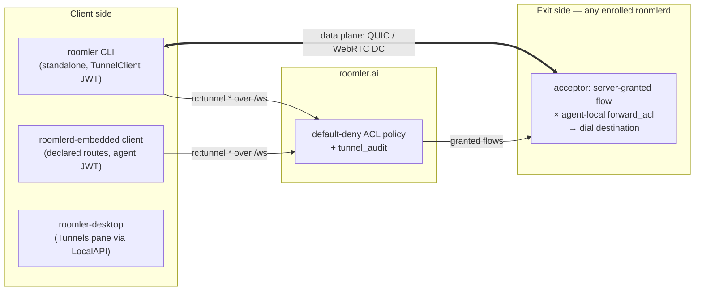
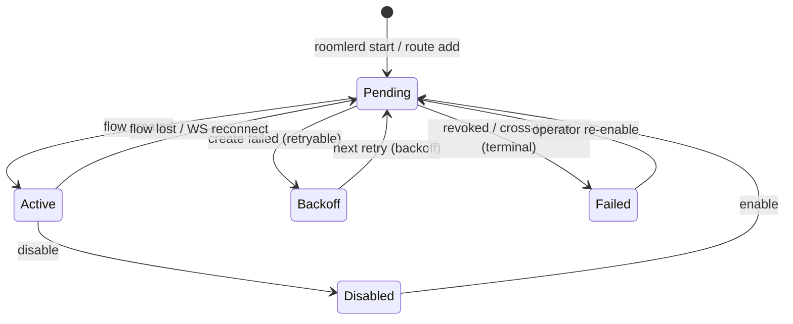
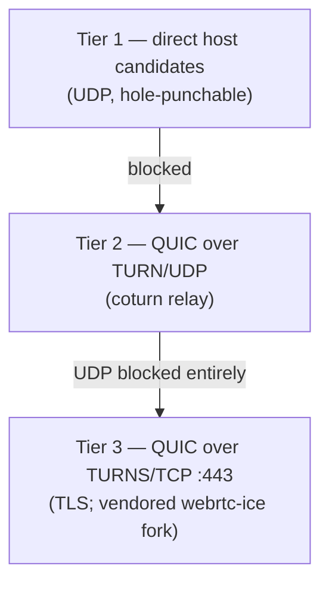
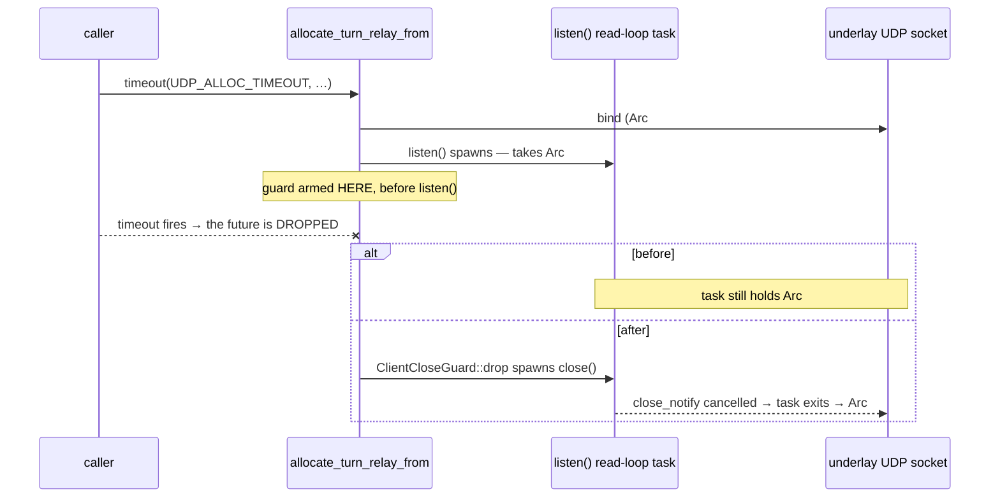
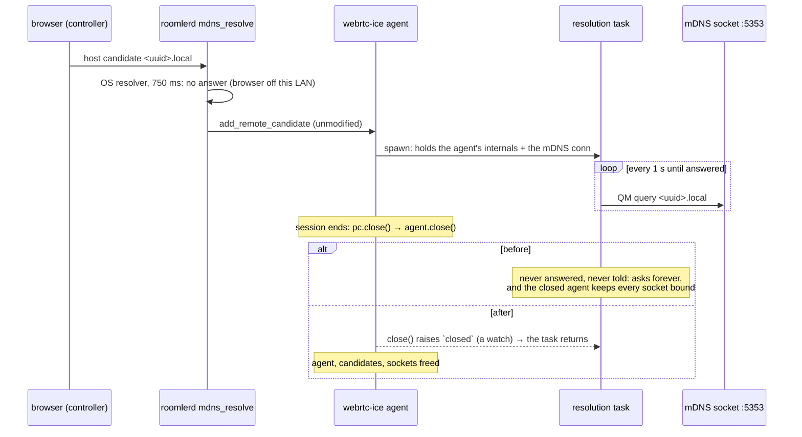

# Tunnels — Concepts & Protocol

How a port on your laptop becomes any `host:port` an enrolled machine can reach.
This is the concepts/reference page; the step-by-step runbook is
[tunnel-install.md](tunnel-install.md), the 5-minute overview is
[agent-tunnel-architecture.md](agent-tunnel-architecture.md), and the L3 mesh the
tunnels increasingly ride on is [overlay-communication.md](overlay-communication.md).
*As of 0.3.0-rc.381.*

## Roles and flow types


```mermaid
flowchart LR
    subgraph client["Client side"]
        CLI["roomler CLI<br/>(standalone, TunnelClient JWT)"]
        DMN["roomlerd-embedded client<br/>(declared routes, agent JWT)"]
        DESK["roomler-desktop<br/>(Tunnels pane via LocalAPI)"]
    end

    subgraph server["roomler.ai"]
        POL["default-deny ACL policy<br/>+ tunnel_audit"]
    end

    subgraph exit["Exit side — any enrolled roomlerd"]
        ACC["acceptor: server-granted flow<br/>× agent-local forward_acl<br/>→ dial destination"]
    end

    CLI & DMN -->|"rc:tunnel.* over /ws"| POL -->|granted flows| ACC
    CLI <==>|"data plane: QUIC / WebRTC DC"| ACC
```

| Flow type | What it does |
|---|---|
| **TCP forward** | `roomler forward --agent <name> --local 127.0.0.1:5432 --remote db:5432` — a local listener whose connections come out of the chosen agent |
| **SOCKS5 (single agent)** | `roomler socks5 --agent <name> --local 127.0.0.1:1080` — RFC 1928 proxy exiting through one agent. CONNECT **and UDP ASSOCIATE** are supported (one UDP flow per destination, idle-reaped); BIND is not |
| **SOCKS5 mesh** | `roomler socks5 --local …` (no `--agent`) — one proxy for the whole tenant: address an agent *by name or id as the SOCKS hostname*, and LAN-IP targets route by longest-prefix match against the subnets agents advertise |
| **Declared routes** | `[[tunnel_routes]]` in the daemon config — `roomlerd` supervises the listeners itself, restart-safe, managed via `roomler route add/rm/ls/enable/disable` or the desktop app |
| **Overlay netstack SOCKS** | a loopback SOCKS5 front into the WireGuard mesh itself (peer names / MagicDNS / overlay IPs, TCP + UDP) — no OS TUN device required |

Declared routes live in a supervisor with explicit state — a revoked or
cross-tenant route parks as `failed` and never hammers the server:


```mermaid
stateDiagram-v2
    [*] --> Pending: roomlerd start / route add
    Disabled --> Pending: enable
    Pending --> Active: flow created
    Pending --> Backoff: create failed (retryable)
    Backoff --> Pending: next retry (backoff)
    Active --> Pending: flow lost / WS reconnect
    Pending --> Failed: revoked / cross-tenant (terminal)
    Active --> Disabled: disable
    Failed --> Pending: operator re-enable
```

## Data-plane transports

Signalling always rides the control WebSocket (`rc:tunnel.*`,
[real-time.md](real-time.md)); flow bytes ride one of the negotiated transports:

| Transport | Wire | Properties |
|---|---|---|
| `quic-v1` (preferred) | quinn; one bidirectional stream per flow | Ephemeral self-signed certs, **SHA-256 fingerprint pinned over signalling** (no CA); low overhead, stream-multiplexed |
| `webrtc-dc-v1` (fallback) | SCTP DataChannel pool with 4-byte flow-mux framing | `bufferedAmountLow` backpressure; the native⇄native SCTP window is raised to 8 MiB (vendored fork) so throughput stays link-bound at high BDP |

QUIC climbs a relay ladder — each side picks its tier independently, so one
NAT-ed side doesn't drag both onto a relay:


```mermaid
flowchart TB
    T1["Tier 1 — direct host candidates<br/>(UDP, hole-punchable)"] -->|blocked| T2["Tier 2 — QUIC over TURN/UDP<br/>(coturn relay)"]
    T2 -->|"UDP blocked entirely"| T3["Tier 3 — QUIC over TURNS/TCP :443<br/>(TLS; vendored webrtc-ice fork)"]
```

Two force-multipliers:

- **Loopback TURN host**: every agent runs an in-process TURN server on loopback
  + its overlay IP (coturn-REST-shaped ephemeral creds). A viewer or client on
  the same machine/LAN gets a "relayed" path with zero WAN round-trip — which is
  why relayed-but-local flows are exempt from the relay bitrate caps.
- **Overlay as carrier**: when both nodes are in the mesh, tunnel flows can ride
  the WireGuard data plane (`wireguard-v1` capability) instead of building their
  own P2P session.

Feature negotiation is version-gated (`agent_supports_quic` / `…_overlay`), so
mixed-version fleets degrade to the transports both ends speak.

### ⚠️ A WebRTC peer MUST be `close()`d — dropping it frees NOTHING

Fixed 2026-08-22. An `RTCPeerConnection`'s UDP sockets — one host candidate per
local address, plus webrtc-ice's mDNS listener on `0.0.0.0:5353` — are owned by
**tasks the ICE agent spawned**, not by the struct, so an `Arc` drop leaves every
one of them live.

`tunnel_core::transport::webrtc_dc::TunnelPeer` had no `close()` and no `Drop`,
and `run_tunnel_session` has many `?` early returns, so **every failed tunnel
session leaked its whole socket set**.

Measured on devbox: `roomlerd` held **15,446 UDP sockets after 12 h** (10,367 on
`:5353`) — the entire 16,384-port ephemeral range. Every socket allocation on the
**host** then failed `WSAENOBUFS`/10055 and **the whole machine lost DNS**, while
`ping 1.1.1.1` stayed at 3 ms.

⚠️ **That signature — names unresolvable, IPs fine, `nslookup` "No response" even
from a reachable server — is a socket-exhaustion tell, not a DNS-server problem.**
Check this first:

```bash
netstat -ano -p UDP | awk '{print $NF}' | sort | uniq -c | sort -rn | head
```

⚠️ It also masquerades as flaky tests: the QUIC/relay-probe loopback tests fail
with the same 10055 when the host is starved.

The fix is an explicit `close()` plus a `Drop` net that spawns it, mirroring
`AgentPeer`. mDNS is additionally `Disabled` in the tunnel `SettingEngine` — it is
a browser privacy feature, both ends here are ours, and `MulticastDnsMode`
defaults to `QueryOnly`, which still binds 5353.

**The amplifier is fixed alongside**: the flow supervisor reset its retry ladder
on *any* clean session end, so a flow that opened and died on arrival span hammered
at the 1 s floor forever. A reset now requires `SESSION_RAN_THRESHOLD` (30 s) of
actual uptime — the condition the code comment already assumed.

### ⚠️ The same trap, a second time: the TURN client (FR-48)

Fixed in `agent-v0.4.100` ([#1556](https://github.com/gjovanov/roomler-ai/pull/1556),
[FR-48](fr/FR-48-roomlerd-ice-socket-leak.md)). Every overlay node leaked **~9 UDP
sockets an hour**, never reclaimed within a daemon's life, and it was the rule above
in a different crate.

`turn::Client` has **no `Drop` anywhere**. `listen()` spawns a read loop that owns a
clone of the underlay socket's `Arc`, and that loop exits only when `close_notify` is
cancelled — which only `Client::close()` does. So dropping the client, or the
`TurnRelayConn` wrapping it, freed nothing; the comment on that field claimed
*"dropping it closes the allocation on coturn"*, and the claim was the leak.

⚠️ **The dominant path was cancellation, not an error return.** Every caller wraps an
allocation in `tokio::time::timeout`, so on a node that cannot reach coturn the usual
outcome is not an `Err` a `?` could catch — it is the whole future being **dropped**
mid-`allocate()`. A fix that closed only on the error paths would pass a happy-path
test and leak exactly the case that happens in the field.


```mermaid
sequenceDiagram
    participant C as caller
    participant A as allocate_turn_relay_from
    participant T as listen() read-loop task
    participant S as underlay UDP socket

    C->>A: timeout(UDP_ALLOC_TIMEOUT, …)
    A->>S: bind (Arc #1)
    A->>T: listen() spawns — takes Arc #2
    Note over A: guard armed HERE, before listen()
    C--xA: timeout fires → the future is DROPPED
    alt before #1556
        Note over T,S: task still holds Arc #2 → socket bound forever
    else after #1556
        A->>T: ClientCloseGuard::drop spawns close()
        T-->>S: close_notify cancelled → task exits → Arc #2 dropped → socket freed
    end
```

The fix is `ClientCloseGuard`, armed **before** `listen()` — the call that spawns the
task holding the `Arc` — so cancellation, `?` and panic all close; `disarm()` hands the
client to `TurnRelayConn`, whose own `Drop` spawns the close when a live connection
goes away. Both allocators are covered: UDP, and TURNS/TCP, where the stranded
resource is a TLS connection and its task, invisible to `ss -uanp` — the same bug.

**Measured after the fix** — an hourly census over 24 h on four fleet hosts, counting only
the daemon's own pid. The "after" column is the longest single daemon lifetime:

| host | before (`0.4.99`) | after (`0.4.100`, 20.0 h) |
|---|---|---|
| jupiter | 134 sockets @ 14.5 h ≈ **9.2/h** | 5 → 5, **0.000/h** |
| zeus | 300 @ 38 h | 5 → 5, **0.000/h** |
| mars | 1269 @ 288 h | 6 → 6, **0.000/h** |
| asahi | 849 @ 292 h | 5 → 5, **0.000/h** |

At the old rate, 20 hours would have added ~180 sockets per host; no host exceeded 7 at any
sample in the full 24 h. The lifetime is 20 h rather than 24 because an unrelated release
auto-updated the fleet mid-window and restarted every daemon — it carried the fix too, and
stayed flat.

#### What made it hard to find — each worth keeping

- ⚠️ **It was eliminated early by counting the wrong event.** "TURN re-allocation"
  was ruled out at 4 events/day against ~11 sockets per 2 h — but that counted
  *successful* re-allocations. The leak came from *cancelled* attempts, which never
  register as one.
- ⚠️ **A snapshot of a long-uptime host is worthless.** The count resets on every
  control-WS reconnect, so a daemon up for 175 h can show 58 sockets while leaking at
  the full rate. Only growth measured **within one daemon lifetime** means anything —
  and one host's uptime ran 175 → 200 h *without* restarting while its count reset
  twice, which is how that was proven.
- ⚠️ **The leak had a period.** Sockets arrived in pairs ~60 s apart every ~20 minutes.
  A 14-minute uprobe window cannot observe a 20-minute period, and one suspect was
  "eliminated" by exactly that. Measure the period before trusting an elimination.
- ⚠️ **`bpftrace` on `comm == "roomlerd"` sees almost nothing.** The daemon runs ~19
  threads named `tokio-rt-worker` and one named `roomlerd`; `comm` is per-thread and
  every socket call happens on a worker. Filter on `pid`.
- 🔑 **`ustack` cannot unwind this binary** (no frame pointers — the frame above
  `__GI_socket` resolves into `[heap]`), **but at function entry the return address is
  at `[rsp]`**, so a uprobe plus one dereference names the caller with no unwinding at
  all. Chaining that walked the stack one reliable level per probe:
  `socket() ← mio::UdpSocket::bind ← tokio::UdpSocket::bind_addr ←
  tunnel_core::transport::relay::allocate_turn_relay_from`.
- ⚠️ **A socket census must count only the daemon's own pid.** A host can run a second
  `roomlerd` inside a container; `pgrep -x roomlerd | head -1` returns whichever comes
  first, and a bare `grep -c roomlerd` sums both. Ask systemd for `MainPID`.

### ⚠️ The same trap, a third time: a closed ICE agent kept by its mDNS resolution (#1740)

Fixed in the vendored `webrtc-ice` ([#1740](https://github.com/gjovanov/roomler-ai/issues/1740)).
Here the peer **was** `close()`d, and the close did run to the end. It still freed
nothing below the ICE agent.

A browser hides its LAN host candidates behind `<uuid>.local` names. `roomlerd`'s
`mdns_resolve` asks the OS resolver first. When that gets no answer within 750 ms, which
is the normal case for a browser that is not on the agent's LAN, the candidate goes
unmodified to webrtc-ice. webrtc-ice resolves it itself: a task that asks `224.0.0.251`
**once a second until someone answers**. The query has no deadline and never notices the
agent closing, and the task held a strong `Arc` of the agent's internals. So every
ended session left its ICE agent alive for the life of the daemon, together with every
UDP socket its candidates owned, the mDNS socket, and the query itself.


```mermaid
sequenceDiagram
    participant B as browser (controller)
    participant R as roomlerd mdns_resolve
    participant A as webrtc-ice agent
    participant Q as resolution task
    participant M as mDNS socket :5353

    B->>R: host candidate <uuid>.local
    R->>R: OS resolver, 750 ms: no answer (browser off this LAN)
    R->>A: add_remote_candidate (unmodified)
    A->>Q: spawn: holds the agent's internals + the mDNS conn
    loop every 1 s until answered
        Q->>M: QM query <uuid>.local
    end
    Note over A: session ends: pc.close() → agent.close()
    alt before #1740
        Note over Q: never answered, never told: asks forever,<br/>and the closed agent keeps every socket bound
    else after #1740
        A-->>Q: close() raises `closed` (a watch) → the task returns
        Note over A: agent, candidates, sockets freed
    end
```

The fix, in the vendored crate (`crates/vendored/webrtc-ice.patch`), is to race the
resolution against the agent's close. The task now holds the agent only weakly, which
is what pion does when it closes the agent's mDNS conn. The same patch also closes a
narrower door: a candidate whose gathering finished **after** `close()` (a late STUN or
TURN answer). It was started and kept, and its receive loop held the agent. Now it is
closed on arrival. Both are locked by `agents/roomlerd/src/ice_lifetime_tests.rs`, which
counts the tasks alive on a runtime of its own. Without the patch, a closed agent
leaves one behind in each test; with it, none. CI runs them in its Linux lib-test
lane, where a host that cannot open the mDNS socket fails the mDNS test instead of
passing it vacuously. They also pass natively on Windows, where the mDNS socket opens
too, so Windows hosts had the leak as well.

**Measured** on a vmtest Ubuntu root daemon with the #1730 drop harness (the production
viewer's container SIGKILLed once it streams): three ended sessions on each build, same
guest, same harness. The "before" build is master with #1739, i.e. what the next release
would have shipped without this fix.

| | UDP sockets | on `:5353` | mDNS queries in 10 s | ctx switches/s |
|---|---|---|---|---|
| before, no session yet | 3 | 0 | 1 (not the daemon's) | 13.5 |
| before, after 3 ended sessions | **54**, +17 each | **3**, +1 each | **61**, +20 each | 27.1, ≈ +4.5 each |
| after, no session yet | 3 | 0 | 1 | 11.3 |
| after, after 3 ended sessions | **3** | **0** | **1** | 11.4 once idle |

The "before" rows are what every ended session cost, cumulatively, until the daemon
restarted, which in practice means until the next update. At this guest's 17 sockets a
session, Windows' default 16,384-port ephemeral range would last about a thousand
sessions, the same exhaustion as the 08-22 note above. (The per-session count depends on
the host's interfaces. It was measured on this guest, not on a Windows host.)

The signature, one line on the host: the daemon asking, once a second, for the same
`<uuid>.local` names, names that belong to sessions which ended long ago.

```bash
sudo timeout 10 tcpdump -ni any 'udp dst port 5353' | grep -oE '[0-9a-f-]{36}\.local' | sort | uniq -c
```

#### What made it hard to find

- ⚠️ **The peer's own objects were all freed**, and that made "the session leaked"
  look disproven. Weak probes on the `RTCPeerConnection` and on its SCTP and DTLS
  transports all read 0 ten seconds after the close. The leak was one level down,
  in an ICE agent that nothing in the peer referenced any more.
- ⚠️ **The noise at every close looked like the evidence.** Each session end logs
  `Failed to close candidate … the agent is closed`. Those are the *browser's*
  candidates: they were never started and never had a socket.
- 🔑 **The task dump named no crate at all.** Release inlining left only the leaf
  shape: one task per unanswered name, `PollFn → {Sleep, mpsc::recv, mpsc::recv}`.
  That is exactly `webrtc_mdns::DnsConn::query`'s loop, and the `tcpdump` above
  confirmed it: four names, ten queries each, two sessions after they ended.
- ⚠️ **It was filed as a per-*drop* residue, but nothing about it is specific to a
  drop.** The drop harness was simply the only thing measuring it. The unit test
  closes an agent that never had a session at all.

The same investigation found the control channel owning itself: its `on_message`
closure held a strong clone of the channel it is stored in, so a session's control
channel, and everything its handler captures, was never freed. It now holds a `Weak`.

## Policy — two independent gates

1. **Server-side ACL** (`tunnel_policies`, default-deny): evaluated per flow open
   as *subject* (user / tunnel client) × *target* (agent) × *destination*
   (`host:port`, protocol). Managed in the admin UI; every decision lands in
   `tunnel_audit` (90 d).
2. **Agent-local `forward_acl`** (config.toml): the exit machine's own last word —
   it survives a compromised server. Empty-but-enabled means "trust the server".

## LocalAPI

The on-host control surface — how `roomler`, `roomler-desktop`, and scripts talk
to a running `roomlerd` without any token:

- **Endpoints**: Windows named pipe `\\.\pipe\roomler` (SYSTEM + Admins +
  Interactive Users, no-write-up); Unix socket `$XDG_RUNTIME_DIR/roomler.sock`
  (0600).
- **Protocol**: newline-delimited JSON, `{"t": "<verb>", "d": {…}}`.

| Verbs | Purpose |
|---|---|
| `Status` · `Peers` · `Flows` | Node status, mesh peers (carrier, RTT, upgrade state), live flows |
| `Ping {target, timeout_ms, prefer_v6}` | Overlay reachability probe |
| `CreateForward` · `CreateSocks5` · `KillFlow` | Imperative flow control |
| `RouteList` · `RouteAdd` · `RouteUpdate` · `RouteRemove` · `RouteSetEnabled` | Declared-route management (`RouteDescriptor` is one type for wire + disk). `RouteUpdate` replaces a route in one save; an invalid replacement leaves the old route running. A row's `state` is the port's truth (#1685): `active` = the local listener is bound; a flow whose tunnel session is retrying reads `backoff` **with** `flow_id`, `attempts` and `last_error` (additive fields — the tag set is unchanged so an older reader still parses it), `pending` with `flow_id` while its first attempt is in flight |
| `ConsentPending` · `ConsentDecide` | Remote-desktop consent prompts (how the tray approves sessions under a SYSTEM service) |
| `SetDeviceName` | Rename the node |
| `ConfigGet` · `ConfigSet` | The config surface, grouped (FR-84 D2) |
| `RestartDaemon` | "Apply now" — restart only under a proven supervisor (FR-84 D3) |
| `EncoderCaps` · `Devices` · `Mesh` | What the companion's Overview and Devices pages show (FR-84 D4, D5) |

⚠️ **On Windows the pipe keeps a pool of listening instances** (`localapi_pipe_pool`,
default 4; `1` is the pre-FR-84 single instance). With one instance, a client that
opened the pipe while another was being served got `ERROR_PIPE_BUSY` at once — the
companion's three simultaneous polls lost 60 of 60 bursts on the reporting host, and
its Routes page blanked. Clients retry a busy pipe on a bounded backoff (≤ 315 ms).
The companion's side of this is [desktop-companion.md](desktop-companion.md) §3.

## CLI

`roomler` is the tunnel CLI on every platform; on daemon hosts the installed
`roomler` binary is a ~150 KB shim that re-execs `roomlerd cli` — one command
surface, no version skew. On macOS the shim lands at `/usr/local/bin/roomler`
and resolves the daemon inside the `.app` bundle, since there the two binaries
cannot be siblings. (Before rc.454 the macOS `.pkg` shipped **no** CLI at all.) Highlights (run `roomler --help` for the full set):

| Verb | Purpose |
|---|---|
| `enroll --server --token --name` | Enroll this machine as a tunnel client |
| `forward` / `socks5` | Open flows (above); `--transport auto\|quic\|webrtc`; `--daemon` hands ownership to `roomlerd` |
| `route add/rm/ls/enable/disable/edit` | Declared routes |
| `status` / `peers` / `flows` / `ping` (`--json`) | Live node state via LocalAPI |
| `devices` | The devices this node's mesh can see, with display names, from the server (FR-84) |
| `restart` | Restart the daemon through its supervisor — refused when it has none it can prove (FR-84) |
| `kill <flow-id>` · `rename <name>` · `logs` · `config ls/set/clear` | Node management |
| `exec` | Run a command on a fleet device — four default-deny gates, full audit ([fleet-rpc.md](fleet-rpc.md)) |
| `diag host` / `diag pair` | Diagnostic evidence bundles (CLI-side, so new probes don't need a fleet rollout) |
| `self-update` | Tunnel-only hosts update in place; on daemon hosts the MSI/.deb owns the binaries and the shim refuses |

## Corporate-network behaviour

The whole stack is built to work from inside strict networks: outbound-only WSS
control links, TURNS/TCP on :443 as the transport of last resort, the DERP
fallback for the overlay, and installer downloads proxied through `roomler.ai`
(not `github.com`) so AV allow-lists trust them. The field-tested walkthrough —
including TLS-inspecting middleboxes and UDP-free networks — is
[tunnel-install.md](tunnel-install.md).
