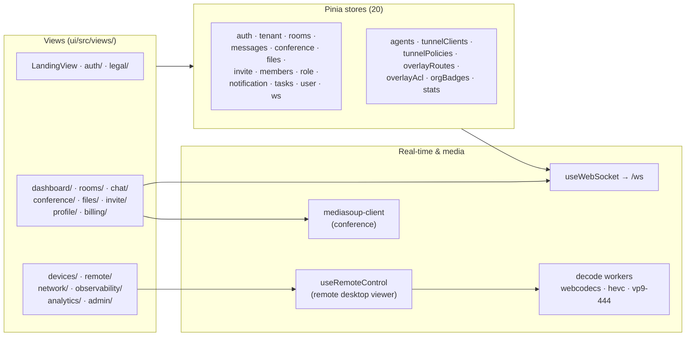
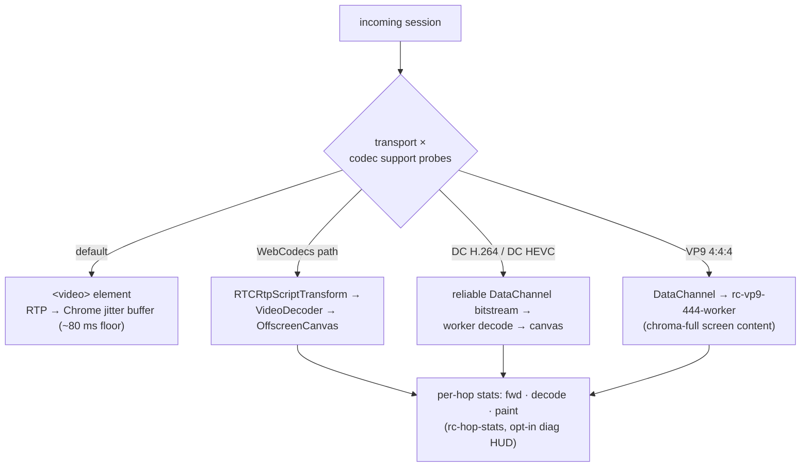

# Frontend

Vue 3 + Vuetify 3 SPA — Vite 7, TypeScript, Pinia (setup-store pattern),
vue-router, vue-i18n (wired, but English-only today). *As of 0.3.0-rc.381.*
Plugin order in `main.ts`: i18n → vuetify → pinia → router.


```mermaid
flowchart LR
    subgraph views["Views (ui/src/views/)"]
        L["LandingView · auth/ · legal/"]
        CORE["dashboard/ · rooms/ · chat/<br/>conference/ · files/ · invite/<br/>profile/ · billing/"]
        FLEET["devices/ · remote/<br/>network/ · observability/<br/>analytics/ · admin/"]
    end

    subgraph state["Pinia stores (20)"]
        S1["auth · tenant · rooms ·<br/>messages · conference · files ·<br/>invite · members · role ·<br/>notification · tasks · user · ws"]
        S2["agents · tunnelClients ·<br/>tunnelPolicies · overlayRoutes ·<br/>overlayAcl · orgBadges · stats"]
    end

    subgraph rt["Real-time & media"]
        WS["useWebSocket → /ws"]
        MS["mediasoup-client<br/>(conference)"]
        RC["useRemoteControl<br/>(remote desktop viewer)"]
        WK["decode workers<br/>webcodecs · hevc · vp9-444"]
    end

    views --> state
    CORE --> WS & MS
    FLEET --> RC --> WK
    state --> WS
```

## Views

| Area | Views | Notes |
|---|---|---|
| Marketing / auth | `LandingView`, `auth/{Login,Register,OAuthCallback}View`, `legal/{Terms,PrivacyPolicy}View` | |
| Collaboration | `dashboard/{DashboardView,TenantDashboard}`, `rooms/{RoomList,ExploreView}`, `chat/ChatView`, `conference/ConferenceView`, `files/FilesBrowser`, `invite/{InviteLanding,InviteManage}View`, `profile/{Profile,ProfileEdit}View`, `billing/BillingView` | `ChatView`/`ConferenceView` own their layout (no `v-container`) |
| Fleet | `devices/DevicesView` (enrolled machines), `remote/RemoteControl` (the viewer), `remote/ConsentView`, `network/NetworkPanel` (overlay mesh), `observability/ObservabilityView`, `analytics/AnalyticsView`, `admin/AdminPanel` | |
| Fallback | `NotFoundView` | |

## Stores (20)

`auth` · `tenant` · `user` · `rooms` · `messages` · `conference` · `files` ·
`invite` · `members` · `role` · `notification` · `tasks` · `ws` — the
collaboration core — plus the fleet set: `agents`, `tunnelClients`,
`tunnelPolicies`, `overlayRoutes`, `overlayAcl`, `orgBadges` (multi-org
indicators), `stats` (observability series).

## Composables (13)

| Composable | Purpose |
|---|---|
| `useAuth` | Session + token lifecycle |
| `useWebSocket` | The `/ws` connection + event dispatch into stores |
| `useRemoteControl` | The entire remote-desktop viewer engine (below) |
| `useConferenceLayout` / `useActiveSpeaker` / `useAudioPlayback` / `usePictureInPicture` | Conference UX |
| `useMarkdown` | markdown-it + DOMPurify rendering |
| `usePush` | Web-push subscribe/unsubscribe |
| `usePageViews` | SPA route-change beacon (`/api/stats/pageview`) |
| `usePolling` | Shared polling helper |
| `useSnackbar` / `useValidation` | UX utilities |

## The remote-desktop viewer (`useRemoteControl.ts`)

The largest module in the frontend — the browser side of the pipeline documented in
[encoders.md](encoders.md).

**Render paths** (user-switchable, persisted, feature-probed):


```mermaid
flowchart TB
    IN["incoming session"] --> Q{"transport ×<br/>codec support probes"}
    Q -->|default| V["&lt;video&gt; element<br/>RTP → Chrome jitter buffer (~80 ms floor)"]
    Q -->|"WebCodecs path"| W["RTCRtpScriptTransform →<br/>VideoDecoder → OffscreenCanvas"]
    Q -->|"DC H.264 / DC HEVC"| DC["reliable DataChannel bitstream →<br/>worker decode → canvas"]
    Q -->|"VP9 4:4:4"| VP["DataChannel → rc-vp9-444-worker<br/>(chroma-full screen content)"]
    W & DC & VP --> HUD["per-hop stats: fwd · decode · paint<br/>(rc-hop-stats, opt-in diag HUD)"]
```

- **Decode workers** (`ui/src/workers/`): `rc-webcodecs-worker`, `rc-hevc-worker`,
  `rc-vp9-444-worker`, with `rc-hop-stats` shared hop-timing instrumentation.
- **Support probes** per codec (H.264/HEVC/AV1/VP9): software + hardware decode
  detection; HEVC-over-DC is offered only when *agent hardware encode × viewer
  hardware decode* both hold.
- **Transport control**: auto-pick, priority dial (balanced / sharper / smoother),
  keyframe requests, decoder-stats feedback to the agent (`rc:decodestat` — drives
  its frame-skip rate control), agent-local loopback-TURN probe for fast relayed
  paths on the same LAN.
- **Input**: HID-mapped keyboard (keyboard-lock, Ctrl-Alt-Del / SAS chord),
  letterboxed + direct coordinate normalization, multi-monitor layout + display
  match, resolution/scale control.
- **Clipboard bridge**: text / HTML / image / native formats, chunked over a DC,
  hash + echo-gate dedupe, auto-sync on focus; optional local-agent loopback
  bridge for full-fidelity RTF.
- **File transfer**: chunked uploads/downloads, folder download (streamed zip),
  resumable, cancellable.
- **Remote apps**: list / focus / launch on the controlled host.
- **Diagnostics**: stats polling, jank detector, long-task observer, inbound-RTP
  diagnostics, agent-log fetch — surfaced in an opt-in HUD.
- **Resilience**: reconnect with backoff, decode-pressure shedding.

## Observability components

`ui/src/components/stats/`: `MeshGraph` (d3 force graph of overlay edges +
carrier types), `TimeSeriesChart`, `UptimeStrip`, `UsagePanel`, `UsageTable`,
`UsageTimeline`, `RangePicker` — fed by the `stats` store from
`/api/tenant/{tid}/stats/*` and `/api/admin/stats/*`.

## Admin components (`ui/src/components/admin/`)

`AgentsSection` (device management: caps chips, exec policy, join-org, update) ·
`AgentCrashesDialog` · `AgentLogsDialog` · `DeviceConsoleDialog` (fleet-RPC exec) ·
`ExecAuditSection` · `ExecPolicyDialog` · `AclSection` + `OverlayAclSection`
(overlay L3 ACL + mode) · `OverlaySubnetRoutesSection` (approved routes / exit
nodes) · `MagicDnsSection` · `TunnelPoliciesSection` · `MembersSection` ·
`RolesSection` · `SettingsSection`.

## Everything else

- **Chat**: TipTap v3 editor (markdown, mentions, emoji via emoji-mart, Giphy
  picker), threads, reactions, pins.
- **Conference**: mediasoup-client composables + `VideoTile`, layout modes,
  active-speaker tracking, PiP.
- **Theming**: Vuetify light/dark with localStorage persistence.
- **API client**: `ui/src/api/client.ts` — token injection + refresh handling.
- **Dev proxy**: Vite proxies `/api` + `/ws` to `http://localhost:5001`.

## Build & test

```bash
cd ui
bun run dev            # Vite dev server :5000
bun run build          # vue-tsc --noEmit + production build
bun run test:unit      # Vitest (jsdom)
bun run e2e            # Playwright (32 spec files)
```

Test layout: unit specs in `ui/src/__tests__/` (stores, composables — including
the `rc:*` ws channel and `useRemoteControl` HID/button-mapping locks), E2E specs
in `ui/e2e/` with fixtures in `ui/e2e/fixtures/test-helpers.ts` — see
[testing.md](testing.md).
