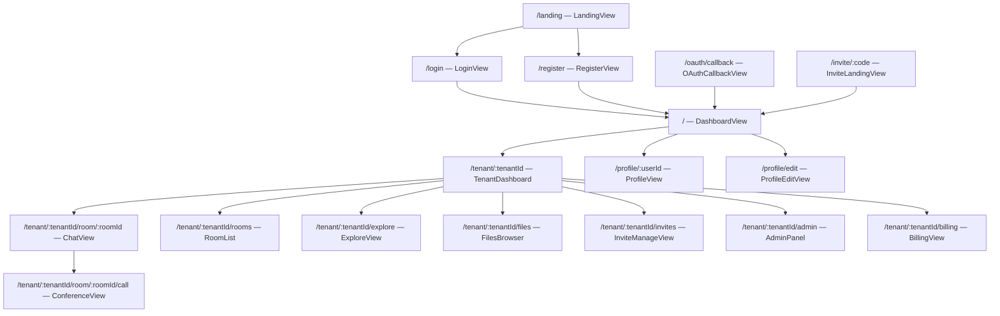

# Frontend

The frontend is a Vue 3 single-page application using Vuetify 3, Pinia, and Vue Router.

## Page Map



## Routes

| Path | Name | Component | Auth | Description |
|------|------|-----------|------|-------------|
| `/landing` | `landing` | `LandingView` | Guest | Landing page |
| `/pricing` | `pricing` | `LandingView` | Guest | Pricing (same component) |
| `/login` | `login` | `LoginView` | Guest | Login page |
| `/register` | `register` | `RegisterView` | Guest | Registration page |
| `/oauth/callback` | `oauth-callback` | `OAuthCallbackView` | Guest | OAuth callback handler |
| `/invite/:code` | `invite` | `InviteLandingView` | — | Invite landing page |
| `/` | `dashboard` | `DashboardView` | Yes | Global dashboard (tenant list) |
| `/tenant/:tenantId` | `tenant-dashboard` | `TenantDashboard` | Yes | Tenant-specific dashboard |
| `/tenant/:tenantId/room/:roomId` | `room-chat` | `ChatView` | Yes | Room chat view |
| `/tenant/:tenantId/room/:roomId/call` | `room-call` | `ConferenceView` | Yes | Video call in room |
| `/tenant/:tenantId/rooms` | `rooms` | `RoomList` | Yes | Room browser |
| `/tenant/:tenantId/explore` | `explore` | `ExploreView` | Yes | Explore public rooms |
| `/tenant/:tenantId/files` | `files` | `FilesBrowser` | Yes | File manager |
| `/tenant/:tenantId/invites` | `invites` | `InviteManageView` | Yes | Manage invites |
| `/tenant/:tenantId/admin` | `admin` | `AdminPanel` | Yes | Tenant admin panel |
| `/tenant/:tenantId/billing` | `billing` | `BillingView` | Yes | Billing & subscription |
| `/profile/edit` | `profile-edit` | `ProfileEditView` | Yes | Edit own profile |
| `/profile/:userId` | `profile` | `ProfileView` | Yes | View user profile |

Auth guard: authenticated routes redirect to `/landing` if no `access_token` in localStorage. Guest routes redirect to `/` if token exists.

## Layout

All authenticated routes are wrapped in `AppLayout.vue`, which provides:
- Navigation sidebar (room tree, tenant selector)
- Top toolbar
- Main content area

## Views

### Auth

| View | File | Description |
|------|------|-------------|
| LoginView | `views/auth/LoginView.vue` | Username/email + password login |
| RegisterView | `views/auth/RegisterView.vue` | Registration with optional tenant creation |

### Dashboard

| View | File | Description |
|------|------|-------------|
| DashboardView | `views/dashboard/DashboardView.vue` | Lists all tenants the user belongs to |
| TenantDashboard | `views/dashboard/TenantDashboard.vue` | Stats and quick actions for a tenant |

### Chat

| View | File | Description |
|------|------|-------------|
| ChatView | `views/chat/ChatView.vue` | Message list, input, threads, Start Call / Join Call button |

### Rooms

| View | File | Description |
|------|------|-------------|
| RoomList | `views/rooms/RoomList.vue` | Browse joined rooms, create rooms with parent selector |
| ExploreView | `views/rooms/ExploreView.vue` | Discover and join public rooms |

### Conference

| View | File | Description |
|------|------|-------------|
| ConferenceView | `views/conference/ConferenceView.vue` | Video call in a room (start/join from chat or dashboard) |

### Files

| View | File | Description |
|------|------|-------------|
| FilesBrowser | `views/files/FilesBrowser.vue` | Upload, browse, download files |

### Profile

| View | File | Description |
|------|------|-------------|
| ProfileView | `views/profile/ProfileView.vue` | View any user's profile (avatar, bio, presence) |
| ProfileEditView | `views/profile/ProfileEditView.vue` | Edit own profile (display_name, bio, avatar, locale, timezone) |

### Invites

| View | File | Description |
|------|------|-------------|
| InviteLandingView | `views/invite/InviteLandingView.vue` | Public invite acceptance page |
| InviteManageView | `views/invite/InviteManageView.vue` | Manage tenant invites (single + batch) |

### Billing

| View | File | Description |
|------|------|-------------|
| BillingView | `views/billing/BillingView.vue` | Stripe billing & subscription management |

### Admin

| View | File | Description |
|------|------|-------------|
| AdminPanel | `views/admin/AdminPanel.vue` | Tenant settings, roles, members |

## Components

| Component | File | Description |
|-----------|------|-------------|
| AppLayout | `components/layout/AppLayout.vue` | Main layout wrapper (sidebar + toolbar + call notification snackbar) |
| MessageBubble | `components/chat/MessageBubble.vue` | Single message display with reactions, attachments |
| MessageEditor | `components/chat/MessageEditor.vue` | Rich message input with emoji/GIF pickers |
| EmojiPicker | `components/chat/EmojiPicker.vue` | Emoji picker component |
| GiphyPicker | `components/chat/GiphyPicker.vue` | GIF picker (Giphy integration) |
| RoomTreeItem | `components/rooms/RoomTreeItem.vue` | Recursive tree node for room hierarchy with context menu and call indicator |
| VideoTile | `components/conference/VideoTile.vue` | Video participant tile in call view |
| LayoutSwitcher | `components/conference/LayoutSwitcher.vue` | Conference layout mode switcher |
| TranscriptPanel | `components/conference/TranscriptPanel.vue` | Live transcription panel |
| ConferenceFilesPanel | `components/conference/ConferenceFilesPanel.vue` | File sharing panel in calls |
| MentionList | `components/chat/MentionList.vue` | @mention autocomplete suggestion dropdown |
| NotificationPanel | `components/layout/NotificationPanel.vue` | Notification dropdown panel in app bar |
| RoomMemberList | `components/rooms/RoomMemberList.vue` | Room member list with role badges |
| RoleAssignDialog | `components/rooms/RoleAssignDialog.vue` | Dialog to assign/change roles |
| BatchInviteDialog | `components/invite/BatchInviteDialog.vue` | Batch invite dialog (multi-email + role) |
| ConfirmDialog | `components/common/ConfirmDialog.vue` | Reusable confirmation dialog |

## Pinia Stores

12 stores manage the application state:

| Store | File | State | Key Actions |
|-------|------|-------|-------------|
| `auth` | `stores/auth.ts` | User profile, tokens | `login`, `register`, `logout`, `refresh`, `fetchMe` |
| `tenant` | `stores/tenant.ts` | Tenant list, current tenant | `fetchTenants`, `createTenant`, `setCurrentTenant` |
| `rooms` | `stores/rooms.ts` | Room list, current room | `fetchRooms`, `createRoom`, `joinRoom`, `leaveRoom`, `explore` |
| `messages` | `stores/messages.ts` | Message list, threads | `fetchMessages`, `sendMessage` (with mentions), `editMessage`, `deleteMessage`, `togglePin` |
| `files` | `stores/files.ts` | File list | `uploadFile`, `fetchFiles`, `deleteFile`, `recognizeFile` |
| `invite` | `stores/invite.ts` | Invite list | `listInvites`, `createInvite`, `batchCreateInvites`, `revokeInvite`, `acceptInvite` |
| `notification` | `stores/notification.ts` | Notifications, unread count | `fetchNotifications`, `fetchUnreadCount`, `markRead`, `markAllRead` |
| `role` | `stores/role.ts` | Role list | `fetchRoles`, `createRole`, `updateRole`, `deleteRole`, `assignRole`, `unassignRole` |
| `user` | `stores/user.ts` | User profile | `fetchProfile`, `updateProfile` |
| `tasks` | `stores/tasks.ts` | Background task list | `fetchTasks`, `pollTask`, `downloadTaskOutput` |
| `ws` | `stores/ws.ts` | WebSocket connection state | `connect`, `disconnect`, `send`, handlers for room:call_*, notification:* events |

## Composables

| Composable | File | Description |
|------------|------|-------------|
| `useAuth` | `composables/useAuth.ts` | Auth state and guards for components |
| `useWebSocket` | `composables/useWebSocket.ts` | WebSocket lifecycle management |
| `useMediasoup` | `composables/useMediasoup.ts` | mediasoup-client WebRTC device management |
| `useConferenceLayout` | `composables/useConferenceLayout.ts` | Conference view layout modes |
| `useActiveSpeaker` | `composables/useActiveSpeaker.ts` | Active speaker detection |
| `usePictureInPicture` | `composables/usePictureInPicture.ts` | Picture-in-picture video support |
| `useMarkdown` | `composables/useMarkdown.ts` | Markdown rendering |
| `useAudioPlayback` | `composables/useAudioPlayback.ts` | Audio playback for recordings |

## Build

```bash
cd ui
bun install
bun run dev       # Development server (Vite)
bun run build     # Production build (vue-tsc + vite build)
bun run preview   # Preview production build
```

## Testing

```bash
cd ui
bun run test:unit          # Vitest unit tests
bun run test:unit:watch    # Watch mode
bun run test:unit:coverage # Coverage report (v8)
bun run e2e                # Playwright E2E tests
bun run e2e:ui             # Playwright UI mode
```

Unit test config: `vitest.config.ts` (jsdom environment, @vue/test-utils, `@` alias to `src/`).
