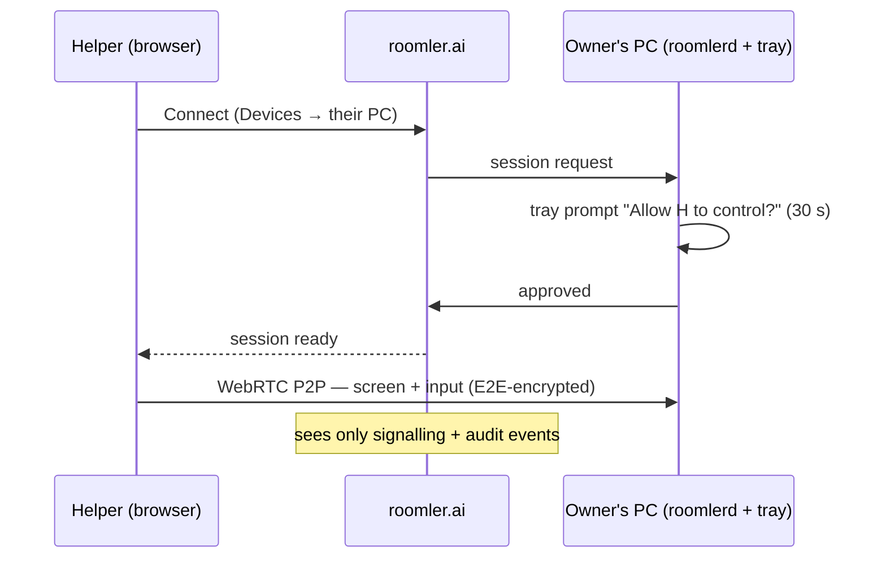
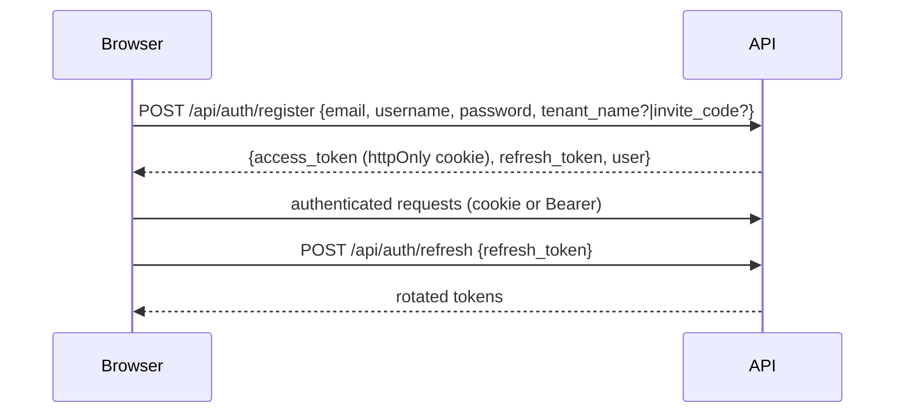
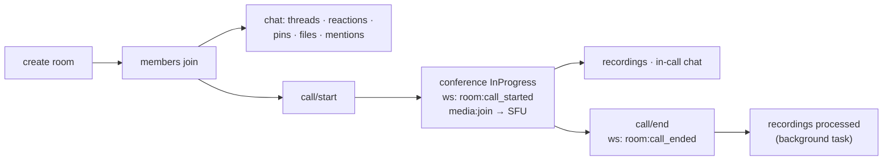
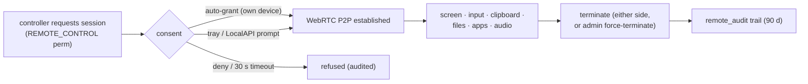

# Use Cases

What people run Roomler for, followed by the key flows (permissions, lifecycles)
that make those scenarios work. Scenarios first — no internals required; flows
second — for operators and developers.

## Scenarios

### A team hub — chat, calls, files

The classic pillar: hierarchical rooms (text + voice/video), threads, reactions,
mentions, per-room calls on the mediasoup SFU, recordings, file library with AI
document recognition, full-text search. One org = one tenant; roles gate
everything (see [permission system](#permission-system)).

### Remote support with consent

Help a family member or a colleague: they enroll their PC once (a 10-minute
token), you connect from a browser tab. The session is consent-gated on their
side and every event is audit-logged.



### Unattended fleet access

Your own machines: office PC from home, headless cloud servers (virtual-desktop
mode gives them a screen), a GPU workstation driven from a thin laptop over a
hardware-encoded, low-latency stream. On Windows the SystemContext service
controls the lock screen, UAC prompts, and pre-logon — a reboot doesn't lock you
out. Auto-consent is the default for self-controlled hosts.

### The database behind the office firewall

```bash
roomler forward --agent office-1 --local 127.0.0.1:5432 --remote db.internal:5432
psql -h 127.0.0.1   # you're inside
```

No VPN concentrator, no exposed port — the flow rides an outbound-only tunnel and
is gated by a default-deny ACL policy an admin manages centrally
([tunnels.md](tunnels.md)).

### Seeing the network as another machine sees it

`roomler socks5 --agent berlin-1 --local 127.0.0.1:1080` gives any app a SOCKS5
proxy that exits from that machine — corp-LAN dashboards, region-locked services,
E2E tests from a real customer vantage. Mesh mode (`--agent` omitted) reaches the
*whole fleet* through one proxy, addressing agents by name.

### A private network across home, office, and cloud

Every daemon is an overlay-mesh node: stable private IP (`100.64.0.0/10`),
MagicDNS name (`gpu-1.<your-domain>`), direct LAN paths when possible, NAT
hole-punching and relays when not ([overlay-communication.md](overlay-communication.md)).
Optional [exit nodes](overlay-exit-nodes.md) route a laptop's entire internet
egress through a trusted machine — hotel Wi-Fi looks like your home connection.

### A harness for AI agents

A controllable desktop on every machine plus fenced networking between them:
enroll a VM, run a coding agent in a tmux session under virtual-desktop mode,
watch it from a browser tab, take over instantly, close the tab and it keeps
running. The overlay gives orchestrators and workers stable names; default-deny
tunnel ACLs decide exactly which hosts and ports a sandbox may touch. More in
[agent-tunnel-architecture.md](agent-tunnel-architecture.md#ai--agentic-development).

### Operating a fleet

The Devices, Network, and Observability views show every machine, the live mesh
graph with carrier types, relay usage, and per-org activity.
`roomler exec` / the device console run commands on trusted devices through four
independent default-deny gates with a full audit trail ([fleet-rpc.md](fleet-rpc.md)).

---

## Permission System

A **u64 bitfield** per role; a member's effective permissions are the union of
their assigned roles. 29 flags today:

| Bit | Flag | Grants |
|-----|------|--------|
| 0 | `VIEW_CHANNELS` | See rooms |
| 1 | `MANAGE_CHANNELS` | Create/edit/delete rooms |
| 2 | `MANAGE_ROLES` | Role CRUD |
| 3 | `MANAGE_TENANT` | Tenant settings |
| 4–5 | `KICK_MEMBERS` / `BAN_MEMBERS` | Member moderation |
| 6 | `INVITE_MEMBERS` | Create invites |
| 7–14 | `SEND_MESSAGES` · `SEND_THREADS` · `EMBED_LINKS` · `ATTACH_FILES` · `READ_HISTORY` · `MENTION_EVERYONE` · `MANAGE_MESSAGES` · `ADD_REACTIONS` | Chat |
| 15–20 | `CONNECT_VOICE` · `SPEAK` · `STREAM_VIDEO` · `MUTE_MEMBERS` · `DEAFEN_MEMBERS` · `MOVE_MEMBERS` | Voice/video |
| 21 | `MANAGE_MEETINGS` | Start/end conferences |
| 22 | `MANAGE_DOCUMENTS` | File management |
| 23 | `ADMINISTRATOR` | Bypasses every check below 24 |
| 24 | `MANAGE_AGENTS` | Enroll/manage devices, tunnel policies, overlay approvals |
| 25 | `REMOTE_CONTROL` | Open remote-desktop sessions |
| 26 | `VIEW_REMOTE_AUDIT` | Read session audit |
| 27 | `EXEC_DEVICE` | Fleet RPC — deliberately **not** in the default admin set |
| 28 | `VIEW_EXEC_AUDIT` | Read the exec audit log |

```
has(perms, flag) = (perms & ADMINISTRATOR != 0) || (perms & flag == flag)
```

Rooms can overwrite per-role/per-user: `effective = (base & ~deny) | allow`.
Default roles: **member** gets the everyday chat/voice bits; **admin** adds
management bits (but not `EXEC_DEVICE`); the **owner** role has all bits.

## Authentication



Login by email *or* username (Argon2-verified); OAuth via Google / Facebook /
GitHub / LinkedIn / Microsoft. Device credentials (agents, tunnel clients) use
separate JWT audiences and a two-step enrollment — see
[api.md](api.md#authentication).

## Room & call lifecycle

Rooms are polymorphic — capabilities come from fields, not types:
`media_settings` present ⇒ calls possible; `parent_id` ⇒ nested; `is_open` ⇒
publicly joinable; `is_read_only` ⇒ announcements.



## Remote-desktop session lifecycle



## Tunnel policy flow

Default-deny: a flow opens only if an admin-authored policy allows that
*subject* (user / tunnel client) to reach that *destination* through that
*agent* — and the exit machine's own `forward_acl` agrees. Every flow lands in
`tunnel_audit`. Overlay subnet routes and exit nodes follow the same
approve-explicitly pattern (`overlay-node` admin routes, [api.md](api.md#overlay-network)).

## File lifecycle

Upload (multipart, versioned) → MinIO/S3 → optional AI recognition (Claude
vision: raw text, structured JSON, document type, confidence) → download or
cloud sync (Google Drive / OneDrive / Dropbox).

## Invite flow

Invite `{code, max_uses, expires_at, assign_role_ids}` → share link/email/batch →
acceptance creates the membership and assigns roles → status: active / exhausted /
expired / revoked.
