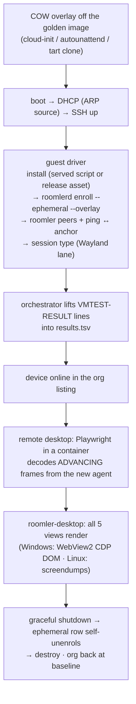
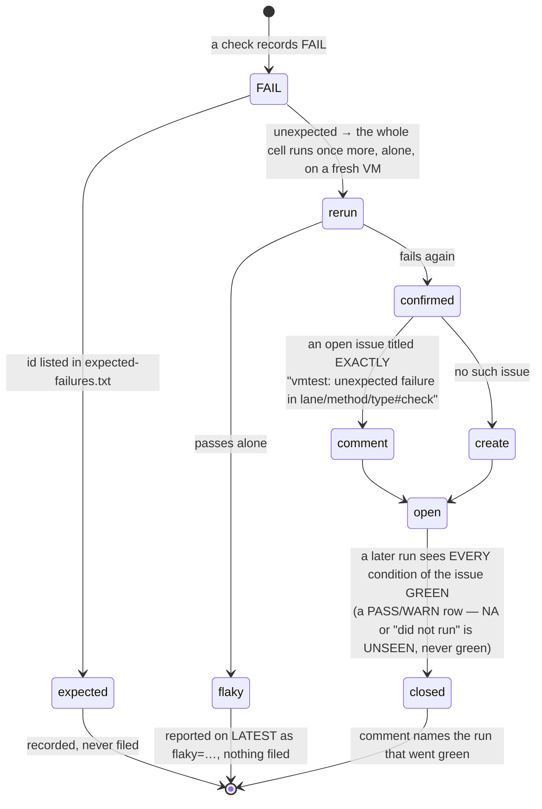

# vmtest — the throwaway-OS install & verify matrix

**FR-61** ([#1199](https://github.com/gjovanov/roomler-ai/issues/1199), spec:
[`docs/fr/FR-61-vmtest-matrix.md`](fr/FR-61-vmtest-matrix.md)). The product's
acceptance bar is "it just works" on a machine somebody actually has, and until
this harness existed nothing installed roomler the way a user does:
`installer-smoke.yml` covers two cells and stops before enrollment, and every
recent install-path defect (FR-49, FR-50, the macOS first-class arc, FR-53)
shipped for exactly that reason and was found by a **human** doing a field
install. vmtest boots a **lean throwaway VM** per cell on the fleet hosts,
installs from the **real served scripts and release assets**, enrols against
production in a dedicated org, proves **remote desktop, the overlay and
`roomler-desktop`**, and destroys the VM. Its run-and-tweak phase found 35 field
defects in its first day; since 0.4.75 the whole matrix has been green in one
pass on every release it was pointed at.

> **This page is the engineering record of the harness.** The step-by-step
> operator runbook (hosts, credentials, the traps with their exact commands)
> lives in the private `vmtest` skill and in `roomler-ai-deploy/vmtest/README.md`;
> what is here is everything a maintainer needs to reason about a red cell.

## What a cell proves



Every check is a result id `lane/method/type@host#check`, recorded `PASS`,
`FAIL`, `WARN` or `NA` with a one-line detail:

| check | asserts | how |
|---|---|---|
| `install` | the served script / release installer put `roomlerd` (and the companion where one exists) on disk | the guest driver's verdict line |
| `enroll` | `roomlerd enroll --ephemeral --overlay` produced a device that comes **online** | verdict line **and** the org's `/agent` listing (`wait_device_online`) |
| `overlay` | the VM's `roomler peers` sees the anchor and `roomler ping` **round-trips** to it | inside the guest, against a permanent anchor node |
| `overlay-reverse` | anchor → VM | best-effort `WARN`; the forward round-trip already proves both ways |
| `wayland` | the Linux GUI session really is `seat0 … wayland` — the lane's premise | `loginctl` in the guest |
| `rd` | a real browser decodes frames that **advance** | [`ui/e2e/vmtest-remote.spec.ts`](../ui/e2e/vmtest-remote.spec.ts) run in the pinned Playwright image, agent selected by **exact name** (`:36`) so parallel VMs cannot cross-match |
| `desktop` | all five `roomler-desktop` views render | CDP DOM asserts on Windows; `--view` second-launch + `virsh screendump`, pairwise-distinct, on Linux |
| `teardown/org-baseline` | the run leaked no rows (`count ≤ baseline`; the reaper cleaning older leftovers is fine) | polled for 3 min at the end of the run |

⚠️ **The RD oracle is transport-agnostic on purpose.** A software-encode agent
negotiates VP9 4:4:4 over a **DataChannel painted to a `<canvas>`**: there is no
`<video>` and no `inbound-rtp`, so `getStats` and the RTP stats ref both read
zero **while the stream is perfect** (#1297). The gate therefore prefers the
viewer's **own fps readout** (`:114`) and falls back to pixel change (`:128`) —
and fps comes first because a static desktop re-encoded by the FR-38 keepalive is
pixel-identical frame to frame (#1301). Before believing an RD "regression",
open the failure screenshot: it shows the live desktop plus the toolbar's
codec/carrier/fps, and settles product-vs-oracle in seconds.

## The matrix

| Lane (host) | Methods | Types | RD | Desktop |
|---|---|---|---|---|
| **Win11 x86_64** — KVM on zeus, OVMF + swtpm, autounattend golden image | `install.ps1` · silent MSI · **wizard** (one CDP walk to *Done*) | system (`ENABLE_SYSTEM_CONTEXT=1`) / attended / per-user | ✅ | ✅ CDP, 5 views |
| **Ubuntu 24.04 GNOME Wayland** — KVM, cloud-init golden, GDM autologin | `install.sh` · `.deb` | system / per-user (netstack) | ✅ | ✅ screendumps |
| **ARM Linux** — Ubuntu arm64 under QEMU **TCG** on zeus | `install.sh` · aarch64 `.deb` | system | ✅ (Xvfb virtual desktop, SW encode — even under emulation) | N/A: no aarch64 companion; the graceful skip is asserted |
| **macOS arm64** — throwaway **tart** VMs on the operator's Apple-silicon Mac, driven over roomler's **own mesh** | `install.sh` · `.pkg` | agent-only / agent+daemon (marker) | N/A headless (Aqua session + TCC) | N/A (same) |
| `ephem/lifecycle` | — | — | the FR-51 lifecycle as a standing cell: power-cut reap, clean-stop self-unenroll, address recycling, ledger, the anchor untouched ([ephemeral-nodes.md](ephemeral-nodes.md)) | |
| `stress/mesh` (opt-in, `--lane stress`) | — | direct / forced relay | the FR-81 overlay stress arm — the **one** lane that enrols into the fleet org | |

Impossible cells are recorded **`NA` with the reason, never skipped**:
`machine-attended` is a Windows-only concept, ARM has no companion and no
Windows, macOS has no Intel asset, and a headless tart VM has no Aqua session.

🔑 **Two product findings the matrix surfaced on day one**, both silent
matrix-killers wearing an overlay bug's clothes: the test org was on the **Free
plan's 3-device cap**, so every enroll past the anchor plus two orphans got
`403 Device limit reached`; and **per-user overlay is not netstack-configured out
of the box on either OS** — an unprivileged daemon cannot create a WireGuard TUN,
so `overlay_mode=tun` never gets an address until `ROOMLERD_OVERLAY_NETSTACK_SOCKS`
is set (the per-user cells now exercise the "no OS privileges required"
commitment end to end).

## Where the pieces live

| Repo | What |
|---|---|
| `k8s-cluster-multi` (private) | opt-in `playbooks/15-vmtest.yml` + `roles/vmtest-host`: OVMF/swtpm/qemu-aarch64, the `vmtest-net` NAT bridge **with** its `-i virbrX -j ACCEPT` INPUT rule (the documented DHCP-hang foot-gun), image cache, `vmtest-audit` capacity check, the k8s-VM shrink runbook (executed only on a **measured** shortfall) |
| `roomler-ai-deploy` (private) | `vmtest/vmtest.sh` (`bake · run · report · triage · destroy · clean`), `vmtest/lib.sh`, `lanes/<lane>/{bake,cell}.sh`, `guest/*` drivers, `playwright/run-rd-check.sh`, `setup/` (org + anchor bootstrap), `expected-failures.txt` |
| `roomler-ai` (this repo) | [`ui/e2e/vmtest-remote.spec.ts`](../ui/e2e/vmtest-remote.spec.ts) — env-gated (skips everywhere `E2E_AGENT_NAME` is unset), the FR-61 stats hooks in the viewer |

## Design rules (do not regress)

- **Ephemeral enrollment only** ([FR-51](ephemeral-nodes.md)): every VM enrols
  with a reusable ephemeral key from the orchestrator's `.env`; a graceful
  shutdown self-unenrols, the prod reaper is the backstop, and the run ends by
  asserting the org is back at baseline. The **wizard smoke is the one
  exception** — a plain `enroll` cannot consume an ephemeral key (wrong JWT
  audience) — so it mints a single-use standard token and DELETEs its row.
  ⚠️ Never SIGTERM an ephemeral daemon whose row you still need: the install
  auto-starts a configless service → **stop** it → enroll → **one** clean start,
  never `restart`. The `ephem` lane is the deliberate exception where the SIGTERM
  *is* the assertion.
- **Prod isolation**: a dedicated vmtest org (Business plan); nothing in any
  other org is touched; flipping the org's `ephemeral_keys_enabled` off is the
  class-wide kill switch. Only `--lane stress` suspends this, by name, because
  the mesh is tenant-scoped and its targets are real fleet laptops.
- **RD runs promptless by design, not by weakening**: the controller is the
  enrolling admin ⇒ the owner consent path (`Auto`), and `auto_grant_session`
  defaults true at enroll. No consent setting is modified.
- **Overlay is opt-in per device** — a plain install does not join the mesh; the
  lanes pass `--overlay` at enroll. That is the product default, not a harness
  bug.
- **jupiter carries the prod storage node** — the orchestrator refuses it without
  an explicit override, in an announced window only. zeus first, mars overflow.
- **Sequential scheduling** (one guest per host, ≤ 8 GiB): `vmtest-audit` runs
  before every cell and the k8s VMs never need shrinking in normal operation.

## Results, verdict and the regression-issue lifecycle

Each run writes `~/vmtest/<stamp>/` on the orchestrator:

| path | what |
|---|---|
| `results.tsv` | one row per result id: `id<TAB>status<TAB>detail` |
| `cells/<cell>/` | `cell.log`, `guest.log`, `rd/` (spec output + failure screenshot), `desktop-*.ppm`, `audit.log` |
| `rerun/` | the same layout for the **isolated re-run** of every cell that had an unexpected failure |
| `matrix.md` | the run as a table, the re-run table, and the issue-lifecycle log |
| `issues.log` | what was created / commented / closed, or in a dry run what would have been |
| `~/vmtest/LATEST` | one line: `<ts> PASS|FAIL pass= fail= na= total= run= unexpected='<confirmed ids>' flaky='<recovered ids>'` |

**`expected-failures.txt`** holds one *full* result id per line, exact match, so
an expectation never masks a *different* check of the same cell regressing. **An
entry is a claim that you understand the failure**: each carries the reason and
the issue, and is re-tested or deleted when the reason changes (the e2e-nightly
rule — an unexplained entry hid #940 for months).



The rules that make an open issue mean "currently failing":

| rule | why |
|---|---|
| **One isolated re-run before anything is filed** | a real regression fails deterministically; a cell caught in a boot race (guest DNS, the dpkg lock, a slow first frame) recovers alone. `VMTEST_RERUN=0` skips it for a manual tweak loop or the hour-long stress lane, and a single failure then counts as confirmed — `LATEST` says so |
| **One issue per condition**, keyed on `lane/method/type#check` with the host stripped | the same check failing on zeus and on mars is one problem (the host is in the body); a *run* is not a condition. The previous version filed **one issue per run** with an unconditional create: 31 issues in nine days, #1224–#1227 the same wizard cell four times inside an hour, none ever closed by anything but a human's bulk sweep |
| **Exact, client-side title match over a plain open-issue listing** — never `--search in:title` | GitHub's search index is eventually consistent and tokenises loosely: measured 2026-09-25, `in:title "…#overlay"` also returned `…#overlay-reverse`, and a key without its `@host` matched nothing. The listing is the issues API; the match is string equality |
| **Close on green, every condition** | conditions are read back from the body's `` ## `<id>` `` headings, so the pre-dedup per-run issues drain by the same rule — only once *all* the conditions they list are green, so a 17-cell aggregate does not vanish on one repaired cell |
| **Unreached checks record `NA`, not `FAIL`** (`lib.sh lift_verdicts`) | the guest driver `fail_out`s — prints FAIL and exits — so every check after the first FAIL or the first missing verdict was never observed. One refused enroll used to be four FAIL rows (enroll, overlay, wayland and the bare cell) — four issues under per-condition keying |
| **The bare `cell script rc=N` row lands only when the cell has no FAIL row of its own** | the old guard grepped for `<cell><TAB>`, which never matches a `<cell>#check` row, so every failing cell carried a contentless duplicate |
| **Everything sent to GitHub is redacted** | the fleet's SSH targets, the org admin's credentials, the ephemeral key and the org/device ids are masked — a `cell.log` tail can carry any of them, and this repo is public |
| **`vmtest.sh triage --run-dir <dir>`** | re-evaluates a finished run — verdict and lifecycle, `LATEST` untouched — without booting anything; `VMTEST_FILE_ISSUES=0` makes the lifecycle a logged dry run |

⚠️ The old mechanism's header, README and `env.example` all *described* the
isolated re-run from the day it shipped; **no code performed it** until
2026-09-25 — the first unexpected FAIL filed straight away. A mechanism that
cannot be exercised on demand is one whose claims nobody has checked, which is
why `triage` and the dry run exist: they let the lifecycle be driven against a
copied run directory in seconds.

## Traps (each cost a real debug cycle)

- ⚠️ **`roomler status --json`'s overlay address is top-level `.overlay_ip`** —
  there is no `.orgs[].self_v4`.
- ⚠️ **libvirt's default lease source misses leases** on the vmtest network (one
  run finds an IP, an identical next run times out); `domifaddr --source arp`
  finds the guest as soon as it sends traffic.
- ⚠️ **A guest can have SSH up before DNS works and before apt is idle** — three
  races measured within ~2 min of boot: `install.sh rc=6` resolving **github.com**
  (the release-asset host — resolving the server alone is not enough), the
  agent's own `dns error` on `/api/agent/enroll`, and the dpkg frontend lock held
  by `unattended-upgrades`. The Linux lane waits for `cloud-init`, for all three
  hosts to resolve, **stops and masks the apt timers** (waiting for a free lock is
  racy by construction — TCG stretches the window wide enough to lose reliably),
  and names *which* precondition never cleared.
- ⚠️ **`curl … | bash` reports bash's status** — a failed fetch read as `install
  PASS` having installed nothing. Never branch on a piped exit status.
- ⚠️ **A multi-cell run once executed only its first cell** — every `ssh` inside a
  `while read` pipe devoured the loop's remaining stdin. Cells are collected into
  an array first and every command gets `</dev/null`.
- ⚠️ **Playwright version drift kills every RD cell at once**: `ui/package.json`
  pins a caret range, so `npm i` in the container resolves a newer 1.x whose
  browser revision is not in the pinned image. The image tag is the single
  source of truth and the in-container runner is pinned to it. If RD dies
  *identically* in every cell, suspect tooling, not the product.
- ⚠️ **The orchestrator's `roomler-ai` clone is the RD spec's source and can be
  thousands of commits stale** after a history rewrite; resetting it to canonical
  history is a standing pre-flight step.
- ⚠️ **Windows guests**: `$ErrorActionPreference='Stop'` turns native stderr
  (all of `roomlerd`'s logging) into a terminating error; the SSH readiness probe
  must be `echo`, not `true` (absent in PowerShell); a `.ps1` must be ASCII; a
  cloned Win11 guest boots **~3 h ahead of UTC**, which makes a fresh 10-minute
  enrollment token look already expired — resync `w32time` first.
- ⚠️ **macOS**: `tart stop` loses writes made in the running VM (shut down from
  inside); the vmnet resolver times out (DNS is pinned in the golden); `roomler
  exec` splits space-containing argv (use `roomler ssh`, ship scripts as base64);
  the per-user LaunchAgent cannot be online headlessly, so overlay/online checks
  target the daemon row.
- ⚠️ **The anchor container** must be built on the `.deb`'s build distro
  (`ubuntu:22.04` — a 24.04 base dies `undefined symbol snd_device_name_get_hint`),
  run with `NET_ADMIN` + `/dev/net/tun`, and keep a config volume, or it
  re-enrols a fresh row per recreate.
- ⚠️ **A parallel session may run vmtest on the same host and org.** Check
  `tmux ls` and `virsh list` on the host before starting, identify a run
  directory by set-difference around your own invocation (never `ls -t | head -1`),
  and never `destroy --all` while another run may be live.

## Driving it

Everything runs on the orchestrator host from the `roomler-ai-deploy` checkout;
the SSH targets, org id, admin credentials, ephemeral key and anchor address live
in `~/vmtest/.env` there and are never committed anywhere.

```bash
# golden images — once per image refresh, idempotent
VMTEST_ENV=~/vmtest/.env bash vmtest/vmtest.sh bake --lane ubuntu --host zeus

# cells — always in tmux + tee, a cell is 6–10 min; filter with --lane/--method/--type
VMTEST_ENV=~/vmtest/.env bash vmtest/vmtest.sh run --lane ubuntu --method script --type system --host zeus
VMTEST_ENV=~/vmtest/.env bash vmtest/vmtest.sh run                 # the whole supported matrix
VMTEST_ENV=~/vmtest/.env bash vmtest/vmtest.sh run --keep          # leave the VM up to debug

# the verdict, the matrix, the org's device count
bash vmtest/vmtest.sh report

# re-evaluate a finished run's verdict + issue lifecycle, no VMs (dry with VMTEST_FILE_ISSUES=0)
VMTEST_ENV=~/vmtest/.env bash vmtest/vmtest.sh triage --run-dir ~/vmtest/<stamp>

# leftovers
bash vmtest/vmtest.sh destroy --all        # only when no other run is live
```

The private `vmtest` skill wraps these as one command from the dev box and
carries the per-host details.

## Related

- [ephemeral-nodes.md](ephemeral-nodes.md) — the enrollment and reaping
  machinery every cell relies on (FR-51)
- [installation.md](installation.md) — the install paths the matrix exercises
- [testing.md](testing.md) — the other suites and harnesses
- [remote-control.md](remote-control.md) — what the RD check is decoding
- Specs: [FR-61](fr/FR-61-vmtest-matrix.md) · [FR-68](fr/FR-68-stress-cells-multi-org-and-ipam.md)
  (the multi-org cells) · [FR-81](fr/FR-81-mesh-stress-matrix.md) (the stress lane)
